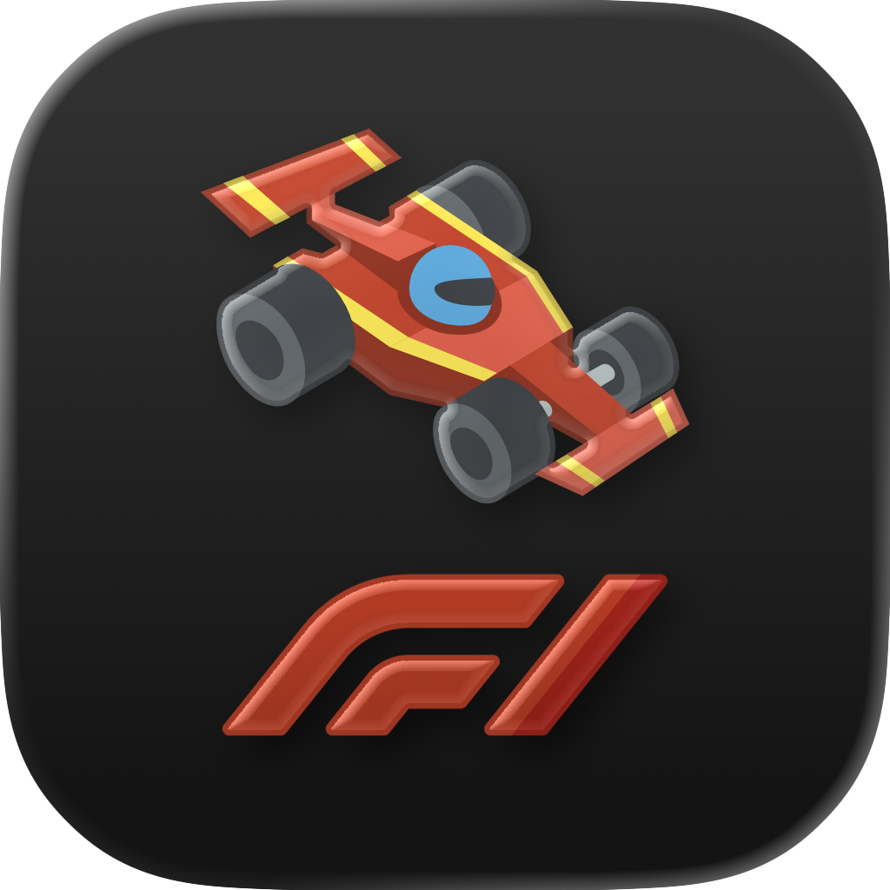
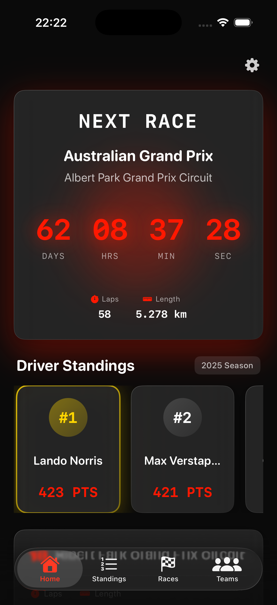
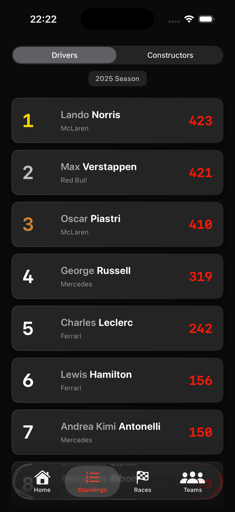
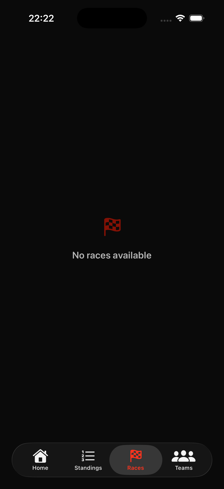
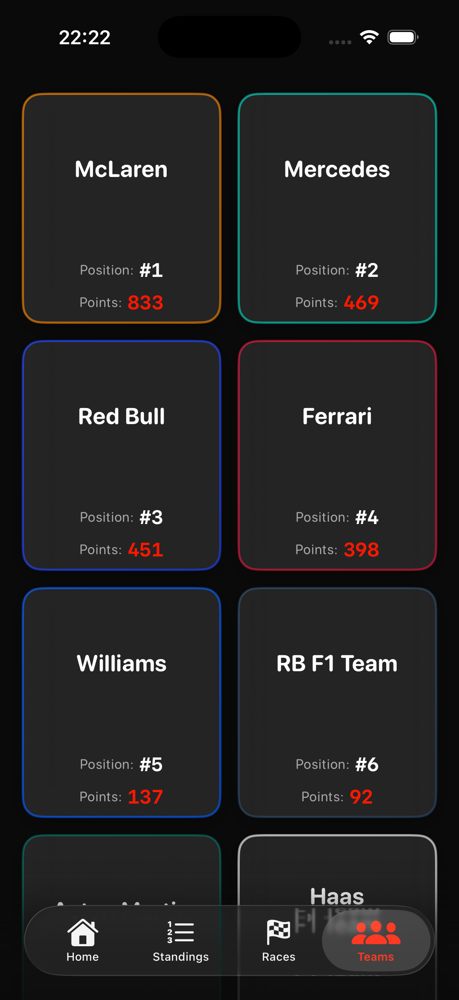

<div align="center">
  
  
  # F1 Dashboard for iOS
  
  **A Premium Formula 1 Companion App Built with SwiftUI**
  
  [](https://swift.org)
  [](https://developer.apple.com/ios/)
  [](https://developer.apple.com/xcode/swiftui/)
  [](LICENSE)
</div>

---

## 📱 Overview

**F1 Dashboard for iOS** is a premium, high-end Formula 1 companion application that delivers real-time race information, driver standings, team statistics, and race calendar in a beautifully designed dark-themed interface. Built entirely with SwiftUI, the app features glassmorphism design, neon red accents, and a modern user experience that matches the excitement of Formula 1 racing.

### Key Features

- 🏁 **Next Race Countdown** - Real-time countdown timer with dramatic red glow effects
- 🏆 **Driver & Constructor Standings** - Complete 2025 season standings with premium card designs
- 📅 **Race Calendar** - Full 2026 season schedule with upcoming/completed race indicators
- 🏎️ **Team Information** - Detailed team cards with official colors and statistics
- 🎨 **Premium UI/UX** - Ultra-dark mode with glassmorphism effects and neon red accents
- 🔄 **Offline Support** - Mock data fallback ensures the app always works

---

## 🎨 Design Philosophy

The app follows a **premium design language** inspired by high-end F1 dashboards:

- **Ultra Dark Mode**: Deep black background (`#0A0A0A`) for optimal viewing
- **Neon Red Accents**: F1 signature red (`#FF1801`) throughout the interface
- **Glassmorphism**: Frosted glass effects with subtle borders and shadows
- **Monospaced Typography**: Technical, fast-paced feel for numbers and data
- **Rounded Fonts**: Modern, friendly typography for text content

---

## 🏗️ Architecture

### Project Structure

```
F1-Dashboard/
├── Models/
│   ├── Race.swift              # Race and circuit data models
│   ├── Driver.swift            # Driver and standings models
│   ├── Constructor.swift       # Constructor/team models
│   └── MockData.swift          # Mock data for offline support
├── Services/
│   └── F1DataService.swift     # Network layer with async/await
├── Views/
│   ├── HomeView.swift          # Main dashboard with countdown
│   ├── StandingsView.swift     # Driver & constructor standings
│   ├── RacesView.swift         # Race calendar
│   ├── TeamsView.swift         # Team grid view
│   └── AboutView.swift         # App information modal
├── Color+Extensions.swift      # Design system extensions
└── ContentView.swift           # Main tab navigation
```

### Technology Stack

- **SwiftUI** - Modern declarative UI framework
- **Combine** - Reactive programming for timers
- **Async/Await** - Modern concurrency for network calls
- **URLSession** - Native networking
- **Codable** - JSON decoding

---

## 🚀 Features in Detail

### 1. Home Dashboard

The home screen features:

- **Hero Countdown Card**: Large, bold countdown timer with red glow effect showing days, hours, minutes, and seconds until the next race
- **Standings Preview**: Top 3 drivers displayed in horizontal scrollable glass cards with gold highlight for #1 position
- **Circuit Information**: Detailed circuit stats including laps, length, and location
- **Premium Header**: F1 logo with settings gear icon

### 2. Standings View

- **Segmented Picker**: Switch between Drivers and Constructors
- **Premium Row Design**: 
  - Gold/Silver/Bronze rank colors for top 3
  - Driver name with team information
  - Large monospaced points display
- **Glass Card Styling**: Frosted glass effect with subtle borders

### 3. Race Calendar

- **Status Badges**: Visual indicators for "Upcoming" (red) and "Completed" (green) races
- **Round Badges**: Clear round numbering
- **Formatted Dates**: Neat date and time display with location
- **Past Race Fading**: Completed races shown with reduced opacity

### 4. Teams View

- **Grid Layout**: 2-column grid of team cards
- **Team Colors**: Official team color borders (Red Bull blue, Ferrari red, Mercedes teal, etc.)
- **Team Statistics**: Position and points clearly displayed
- **Square Cards**: Consistent card sizing for visual harmony

---

## 📡 Data Source

The app fetches data from the **Ergast API** (http://ergast.com/mrd/), a free, open-source Formula 1 API:

- **Next Race**: 2026 season schedule
- **Driver Standings**: 2025 final standings
- **Constructor Standings**: 2025 final standings
- **Race Calendar**: Full 2026 season

### Offline Support

The app includes comprehensive mock data that automatically loads if the API is unavailable, ensuring users always have content to view.

---

## 🛠️ Installation

### Requirements

- iOS 17.0 or later
- Xcode 15.0 or later
- Swift 5.9 or later

### Setup

1. Clone the repository:
```bash
git clone https://github.com/OnurAkyuz61/F1-Dashboard-for-iOS.git
cd F1-Dashboard-for-iOS
```

2. Open the project in Xcode:
```bash
open F1-Dashboard.xcodeproj
```

3. Build and run the project (⌘R)

### Assets

Make sure the following assets are included:
- `f1-logo.png` - F1 logo image used in the header
- App Icon assets in `Assets.xcassets/AppIcon.appiconset/`

---

## 🎯 Usage

### Navigation

The app uses a **TabView** with four main sections:

1. **Home** 🏠 - Dashboard with next race countdown
2. **Standings** 📊 - Driver and constructor standings
3. **Races** 🏁 - Full race calendar
4. **Teams** 👥 - Team grid view

### Settings

Tap the gear icon (⚙️) in the top-right corner of the Home view to view:
- App information
- Data source attribution
- Developer credits

---

## 🔧 Technical Details

### Network Layer

The `F1DataService` class handles all API communication:

- **Async/Await**: Modern Swift concurrency
- **Error Handling**: Comprehensive error catching with debug logging
- **Mock Fallback**: Automatic fallback to mock data on failure
- **Type Safety**: Strongly typed models with Codable

### Design System

**Color Extensions**:
- `Color.f1Red` - F1 signature red (#FF1801)
- `Color.darkBackground` - Ultra dark background (#0A0A0A)

**View Modifiers**:
- `.glassCard()` - Glassmorphism effect with customizable corner radius
- `.glassEffect()` - Alternative glass effect

### Data Models

All models conform to `Codable` and `Identifiable`:
- `Race` - Race information with circuit details
- `Driver` - Driver information and statistics
- `DriverStanding` - Driver championship standing
- `Constructor` - Team/constructor information
- `ConstructorStanding` - Constructor championship standing

---

## 🎨 Screenshots

<div align="center">
  
### Home Dashboard


The main dashboard featuring the next race countdown with dramatic red glow effects, top 3 driver standings preview, and circuit information.

---

### Driver & Constructor Standings


Complete standings view with segmented picker to switch between drivers and constructors. Features premium glass cards with gold/silver/bronze highlights for top positions.

---

### Race Calendar


Full 2026 season race calendar with status badges (Upcoming/Completed), formatted dates, and circuit locations.

---

### Teams Grid


Team grid view displaying all F1 constructors with official team colors, positions, and points in a beautiful 2-column layout.

</div>

---

## 🤝 Contributing

Contributions are welcome! Please feel free to submit a Pull Request. For major changes, please open an issue first to discuss what you would like to change.

### Development Guidelines

1. Follow Swift naming conventions
2. Use SwiftUI best practices
3. Maintain the premium design language
4. Add comments for complex logic
5. Test on multiple iOS versions

---

## 📝 License

This project is licensed under the MIT License - see the [LICENSE](LICENSE) file for details.

---

## 👤 Author

**Onur Akyuz**

- GitHub: [@OnurAkyuz61](https://github.com/OnurAkyuz61)
- Project: [F1-Dashboard-for-iOS](https://github.com/OnurAkyuz61/F1-Dashboard-for-iOS)

---

## 🙏 Acknowledgments

- **Ergast API** - For providing free Formula 1 data (http://ergast.com/mrd/)
- **Formula One Licensing BV** - F1 marks are trademarks of Formula One Licensing BV
- **Apple** - For SwiftUI and the amazing development tools

---

## 📄 Disclaimer

This is an **unofficial** Formula 1 companion app. All Formula 1 marks, logos, and related materials are trademarks of Formula One Licensing BV. This app is not affiliated with, endorsed by, or associated with Formula One or any of its subsidiaries.

---

## 🔮 Future Enhancements

- [ ] Live race timing and lap-by-lap updates
- [ ] Push notifications for race weekends
- [ ] Driver and team detail pages
- [ ] Historical race results
- [ ] Favorite drivers/teams
- [ ] Widget support
- [ ] Apple Watch companion app
- [ ] iPad optimized layout

---

<div align="center">
  <p>Made with ❤️ and SwiftUI</p>
  <p>🏎️ For Formula 1 fans, by Formula 1 fans 🏎️</p>
</div>

